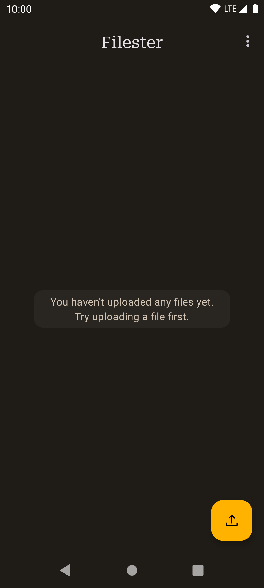
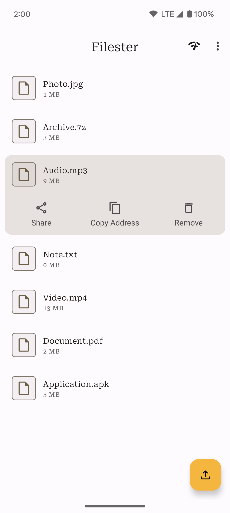
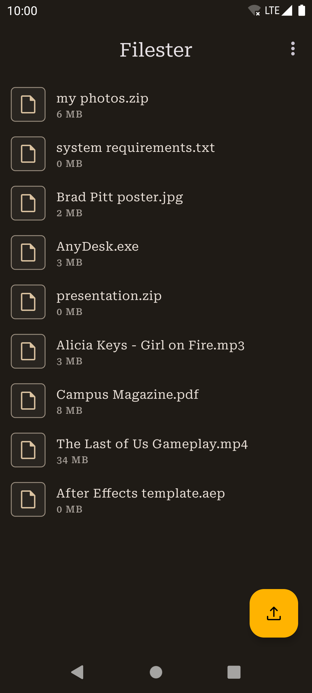
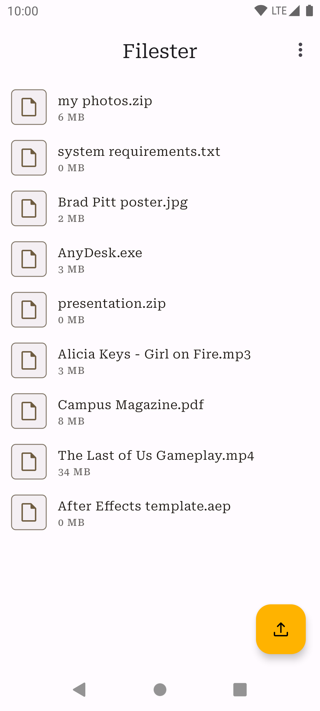
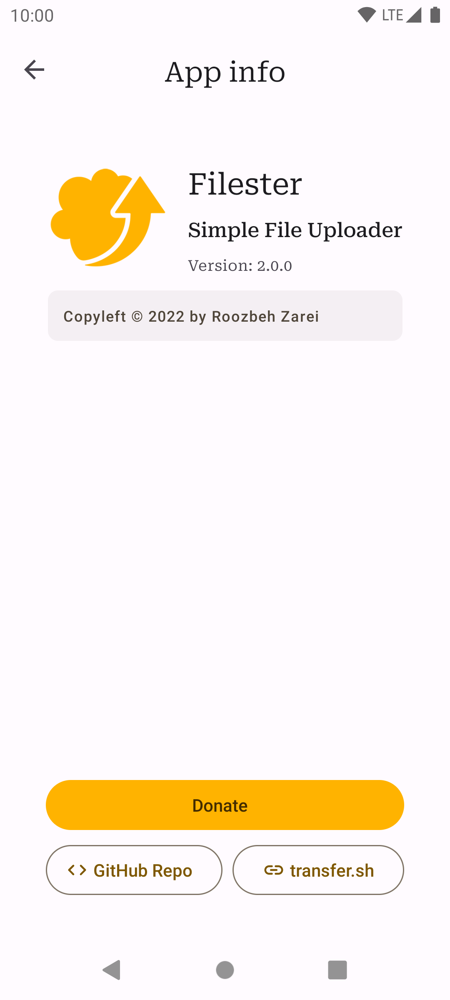
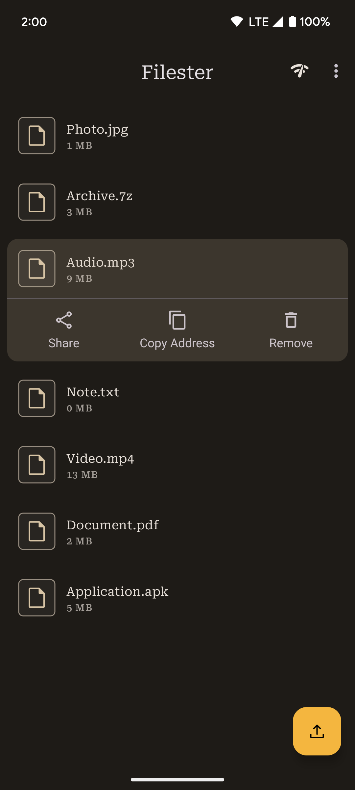
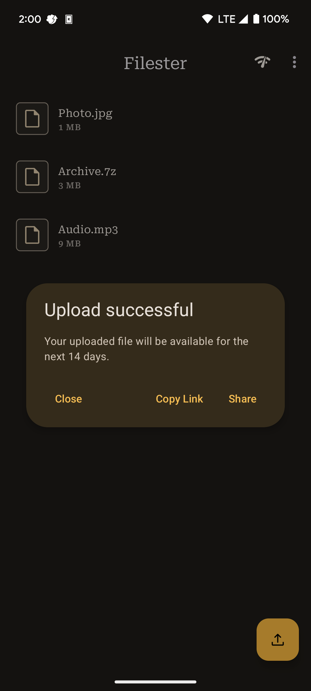

<h1 align="center">
     Filester
</h1>

     A secure, accessible cloud storage app for android.

     
     
     
     

Filester is the cloud storage solution that respects your privacy and puts you in control. No more intrusive ads or sneaky data collection. Just one tap and you're ready to store, share, and access your files from anywhere in the world. With support for a wide range of devices and multiple languages, Filester works seamlessly across your Android ecosystem. So whether you're rocking a classic or a cutting-edge phone, your files are always within reach.

#### Features:

* **Privacy-first:** We are open-source and do not have access to your files.
* **Ad-free experience:** Focus on what matters without annoying interruptions.
* **No account required:** Get started instantly, no sign-ups or commitments.
* **Universal compatibility:** Works across a wide range of devices.

## Screenshots

    
    
    
    
    
    
    
    

## Download

## Build

1. Click the **Code** button, which brings up a dialog.
2. In the dialog, click the **Download ZIP** button to save the project to your computer. Wait for
   the download to complete.
3. Locate the file on your computer (likely in the **Downloads** folder).
4. Double-click the ZIP file to unpack it. This creates a new folder that contains the project
   files.
5. Start Android Studio.
6. In the **Welcome to Android Studio** window, click **Open an existing Android Studio project**.
7. In the **Import Project** dialog, navigate to where the unzipped project folder is located.
8. Double-click on that project folder.
9. Wait for Android Studio to open the project.
10. Click the **Make Project** button to build the app.

## Contributors

* [Ahoora Fakhrian](https://www.linkedin.com/in/ahoorafakhrian) (logo design)
* [Open source community](https://github.com/roozbehzarei/filester/graphs/contributors)

## License

Filester is licensed under [GNU General Public License v3.0](LICENSE).
