<h1 align="center">
     Filester
</h1>

     A secure, accessible cloud storage app for android.

     
     
     
     

Filester is the cloud storage solution that respects your privacy and puts you in control. No more intrusive ads or sneaky data collection. Just one tap and you're ready to store, share, and access your files from anywhere in the world. With support for a wide range of devices and multiple languages, Filester works seamlessly across your Android ecosystem. So whether you're rocking a classic or a cutting-edge phone, your files are always within reach.

#### Features:

* **Privacy-first:** We are open-source and do not have access to your files.
* **Ad-free experience:** Focus on what matters without annoying interruptions.
* **No account required:** Get started instantly, no sign-ups or commitments.
* **Universal compatibility:** Available on a wide range of devices.

## Screenshots

    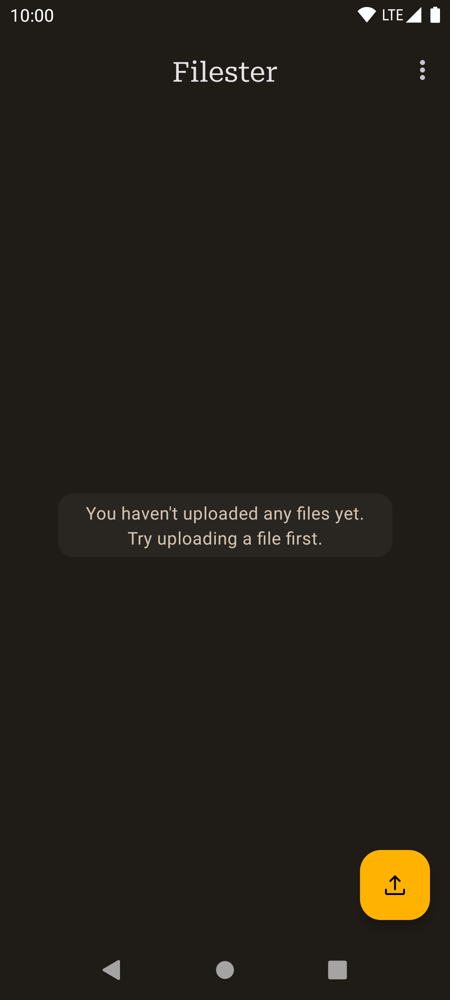
    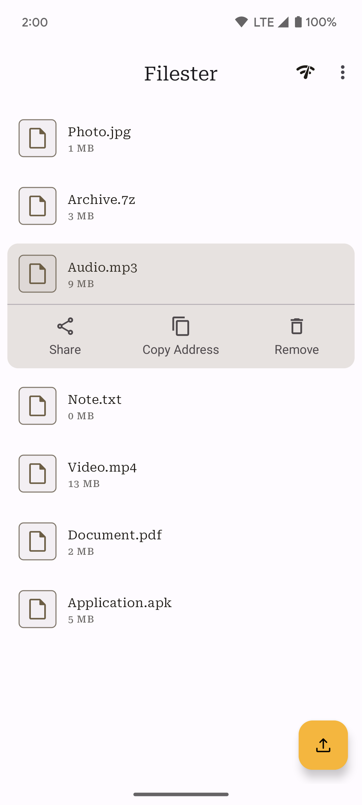
    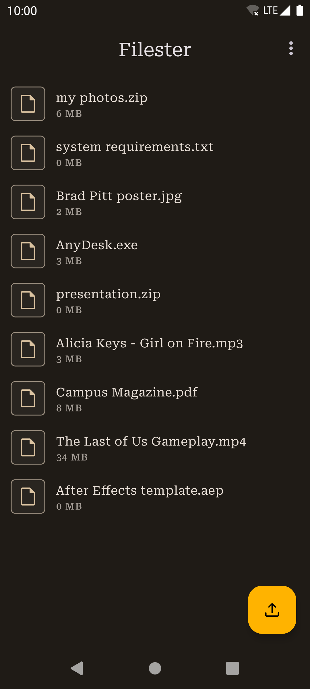
    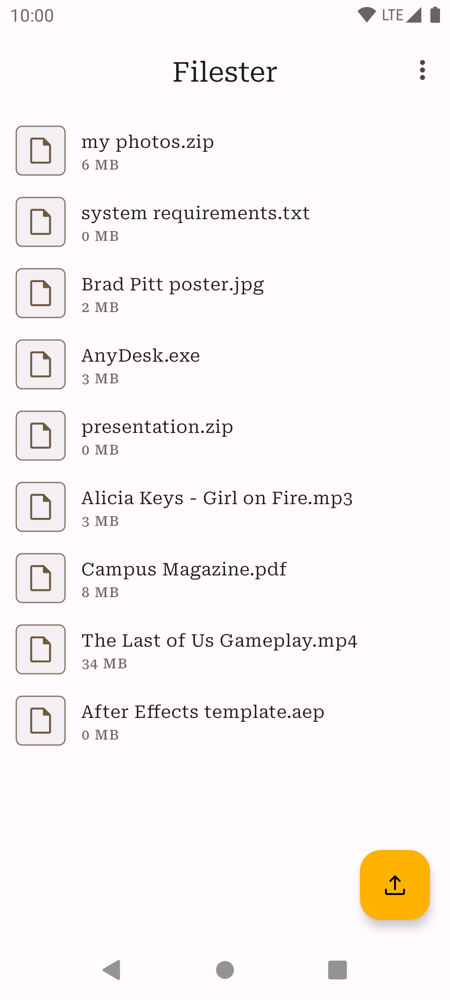
    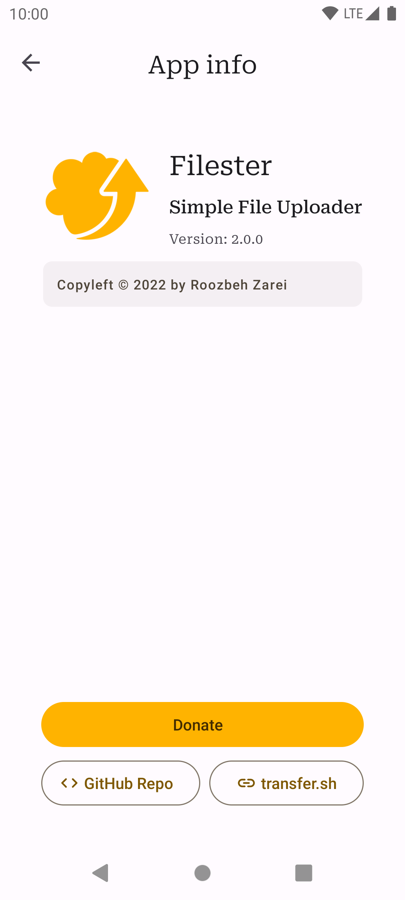
    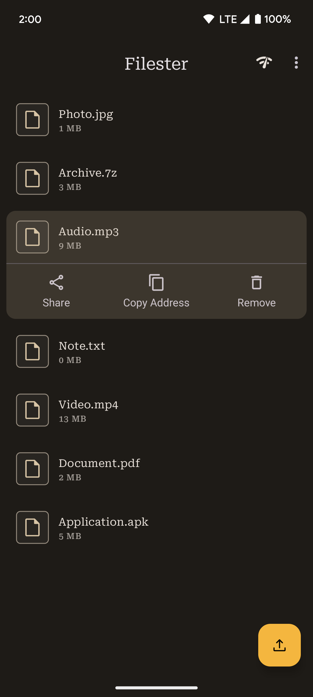
    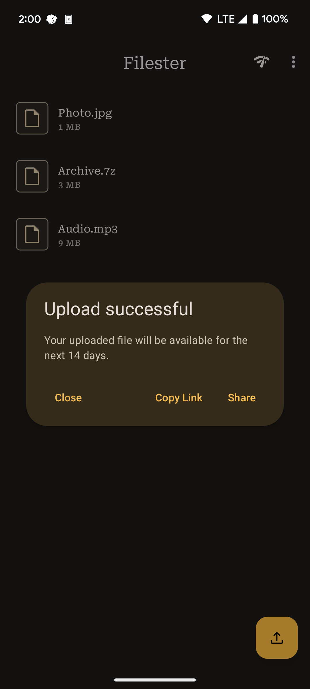
    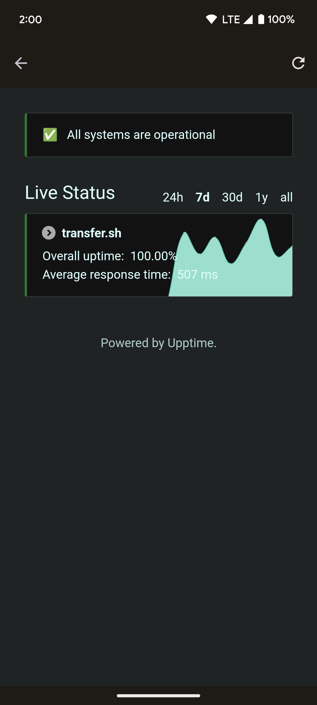

## Download

[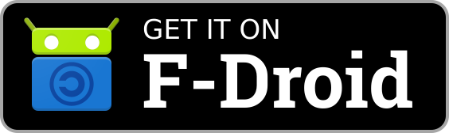](https://f-droid.org/packages/com.roozbehzarei.filester)
[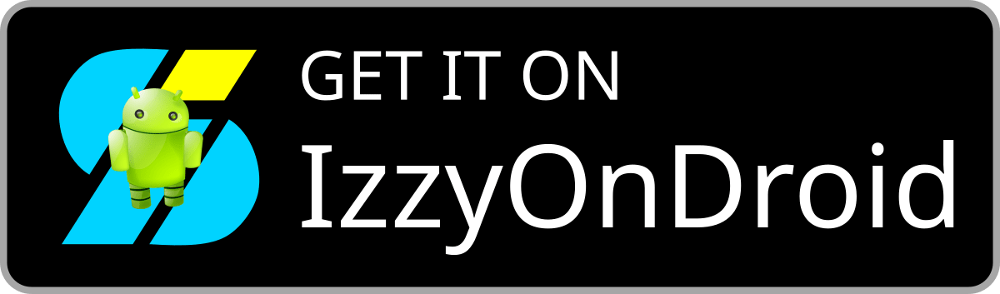](https://apt.izzysoft.de/fdroid/index/apk/com.roozbehzarei.filester)
[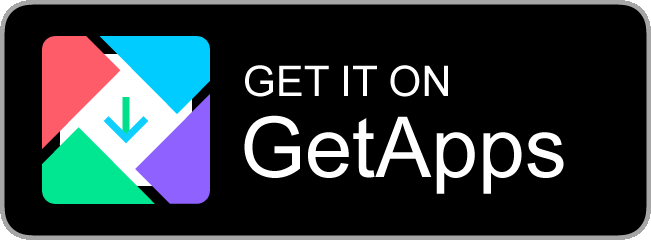](https://global.app.mi.com/details?id=com.roozbehzarei.filester)

## Build

1. Click the **Code** button, which brings up a dialog.
2. In the dialog, click the **Download ZIP** button to save the project to your computer. Wait for
   the download to complete.
3. Locate the file on your computer (likely in the **Downloads** folder) and unpack it.
4. Start Android Studio.
5. In the **Welcome to Android Studio** window, click **Open**.
6. In the **Open File or Project** dialog, navigate to where the unzipped project folder is located and click **Ok**.
7. Wait for Android Studio to open the project.
8. Click the **assemble 'app' Run Configuration** button to build the app.

## Contributors

* [Ahoora Fakhrian](https://www.linkedin.com/in/ahoorafakhrian) (logo design)
* [Open source community](https://github.com/roozbehzarei/filester/graphs/contributors)

## License

Filester is licensed under [GNU General Public License v3.0](LICENSE).